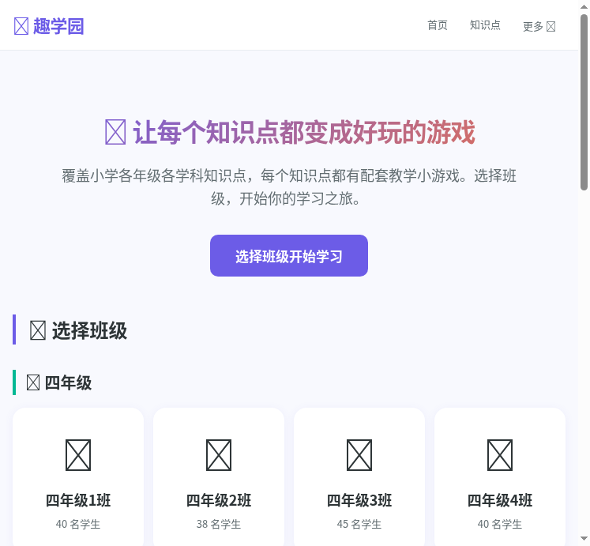
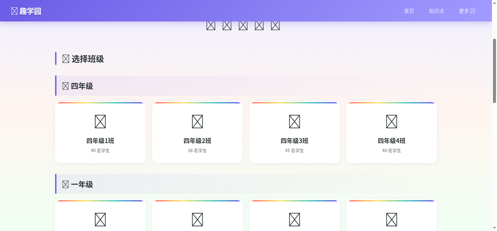
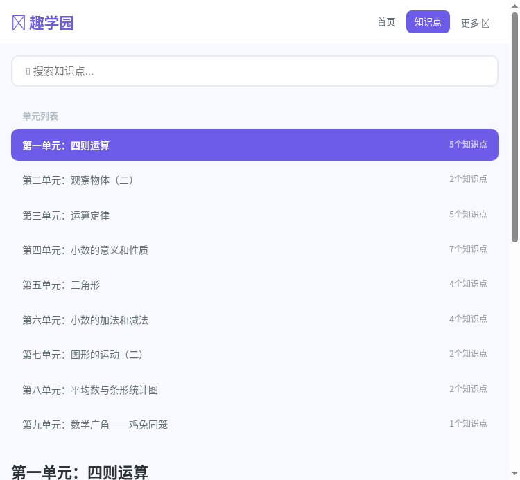

# 🎮 趣学园 — 知识点游戏化教学平台

> **让每个知识点都变成好玩的游戏！**
> 将小学数学知识点转化为精美互动小游戏，通过游戏化学习提升学生学习兴趣和知识掌握率。

> 🏆 **SOLO 挑战赛「Hello AI 科技致善」公益赛道参赛作品** — 命题二：为乡村教师打造得力教学助手

🔗 **在线体验**：[https://game-teach.vercel.app](https://game-teach.vercel.app) | **GitHub**：[FIEforever/game-teach](https://github.com/FIEforever/game-teach)

[](https://vercel.com/new/clone?repository-url=https://github.com/FIEforever/game-teach)

---

## 📸 系统截图

### 首页 — 班级选择


### 班级列表 — 按年级分组


### 知识点浏览 — 单元+知识点树


---

## 📌 项目背景

传统数学教学中，知识点练习往往以枯燥的刷题为主，学生缺乏学习兴趣。趣学园平台将**人教版四年级下册数学**的 32 个知识点，逐一转化为精美的 HTML5 互动小游戏，涵盖 6-8 种不同玩法，让学生在游戏中自然掌握知识。

同时，平台提供**班级管理、学生画像、知识点分析**等教学辅助功能，帮助教师实时了解全班对每个知识点的掌握情况。

---

## ✨ 核心功能

### 🎯 知识点全覆盖
- 覆盖人教版四年级下册数学 **9 个单元、32 个知识点**
- 每个知识点至少配备 **1 个专属小游戏**
- 共 **32 个 HTML5 精美小游戏**，6-8 种不同玩法

### 🏫 班级学生管理
- 支持 **6 个年级 × 4 个班级** 的完整学校架构
- 403 班 **45 名真实学生**名单录入
- 搜索过滤、头像卡片、一键选择

### 🎮 多样化游戏玩法

| 玩法类型 | 代表游戏 | 对应知识点 |
|---------|---------|-----------|
| 水果拖拽 | 🍎 水果篮子加减法 | 加减法的意义 |
| 工厂模拟 | 🍬 糖果工厂 | 乘除法的意义 |
| 漫画冒险 | 💪 零之英雄 | 0 的特性 |
| 横版闯关 | 🏃 括号跑跑跑 | 四则运算应用 |
| 3D 观察 | 🧊 3D 观察家 | 观察物体 |
| 太空探索 | 🪐 定律星球 | 加法交换律 |
| 翻牌配对 | 🃏 乘法配对 | 乘法交换律 |
| 泡泡射击 | 💫 分配律泡泡 | 乘法分配律 |
| 赛车竞速 | 🏎️ 乘法赛车 | 乘法运算定律 |
| 魔法森林 | 🌲 小数世界 | 小数的意义 |
| 密码破解 | 🔐 密码保险箱 | 小数进位退位 |
| 连锁爆炸 | 💥 连锁反应 | 小数混合运算 |
| 对称绘画 | 🎨 对称画板 | 轴对称 |
| 天平称重 | ⚖️ 天平平衡 | 平均数 |
| 农场解谜 | 🐔 农场谜题 | 鸡兔同笼 |
| ... | ... | ... |

### 📊 数据驱动的教学分析

- **学生仪表板**：个人学习全景，知识点掌握率、游戏历史、成绩趋势
- **班级分析面板**：各知识点平均分柱状图、薄弱/优势知识点列表
- **实时掌握情况**：每个知识点显示班级已玩人数和平均分
- **成绩记录**：每次游戏自动记录，支持最高分、游戏次数、正确率追踪

---

## 🛠️ 技术架构

```
┌─────────────────────────────────────────────────┐
│                   前端 (SPA)                      │
│         原生 HTML / CSS / JavaScript              │
│    无框架依赖 · 零构建工具 · 秒级加载            │
├─────────────────────────────────────────────────┤
│                   API 层                          │
│         Express.js RESTful API                   │
│   /api/school  /api/knowledge  /api/games        │
├─────────────────────────────────────────────────┤
│                   数据层                          │
│  本地: SQLite (better-sqlite3)                   │
│  Vercel: 内存 JSON 数据库 (自动切换)             │
├─────────────────────────────────────────────────┤
│                 32 个 HTML5 游戏                   │
│     单文件自包含 · 无外部依赖 · 移动端适配        │
└─────────────────────────────────────────────────┘
```

### 技术选型

| 层级 | 技术 | 理由 |
|-----|------|------|
| 前端 | 原生 HTML/CSS/JS | 零构建、快速迭代、易于理解 |
| 后端 | Node.js + Express | 轻量、Serverless 友好 |
| 数据库 | SQLite / 内存 JSON | 本地开发用 SQLite，Vercel 部署自动切换内存模式 |
| 游戏 | 纯 HTML5 单文件 | 无依赖、即开即玩、易于扩展 |
| 部署 | Vercel | 免费额度、自动 HTTPS、全球 CDN |

---

## 🚀 快速开始

### 方式一：本地运行

```bash
# 1. 克隆仓库
git clone https://github.com/FIEforever/game-teach.git
cd game-teach

# 2. 安装依赖
cd server && npm install

# 3. 初始化数据库（含全部种子数据）
node init-db.js

# 4. 启动服务
node app.js

# 5. 打开浏览器访问
# http://localhost:3000
```

### 方式二：一键部署到 Vercel

[](https://vercel.com/new/clone?repository-url=https://github.com/FIEforever/game-teach)

1. 点击上方按钮
2. 使用 GitHub 账号登录 Vercel
3. 确认部署，等待 1-2 分钟
4. 自动获得线上地址

> Vercel 部署使用内存 JSON 数据库，数据在每次冷启动时重置。如需持久化，建议本地运行。

---

## 📁 项目结构

```
game-teach/
├── api/                        # Vercel Serverless Functions
│   ├── index.js                # Serverless 入口
│   ├── db.js                   # 内存 JSON 数据库（Vercel 模式）
│   └── seed-data.json          # 种子数据（32个知识点 + 961名学生）
├── server/
│   ├── app.js                  # Express 主服务
│   ├── init-db.js              # 数据库初始化 + 种子数据写入
│   ├── models/database.js      # 数据库（自动检测环境切换）
│   ├── routes/
│   │   ├── knowledge.js        # 知识点树 API
│   │   ├── games.js            # 游戏管理 API
│   │   ├── school.js           # 学校/班级/学生/统计 API
│   │   ├── templates.js        # 游戏模板 API
│   │   └── users.js            # 用户 API
│   └── uploads/games/          # 32 个 HTML5 小游戏
│       ├── game-add-sub/       #   🍎 水果篮子加减法
│       ├── game-mul-div/       #   🍬 糖果工厂
│       ├── game-zero-hero/     #   💪 零之英雄
│       ├── game-arithmetic/    #   🧮 四则运算大冒险
│       ├── game-3d-view/       #   🧊 3D 观察家
│       ├── game-law-planet/    #   🪐 定律星球
│       ├── game-dist-blast/    #   💫 分配律泡泡
│       ├── game-mul-race/      #   🏎️ 乘法赛车
│       ├── game-decimal/       #   🔢 小数大比拼
│       ├── game-triangle/      #   🔺 三角形闯关
│       ├── game-chicken-rabbit/#   🐔 农场谜题
│       └── ...                 #   共 32 个游戏
├── web/
│   ├── index.html              # SPA 主页面
│   └── static/
│       ├── css/style.css       # 全局样式
│       └── js/
│           ├── api.js          # API 调用封装
│           └── app.js          # 页面路由与逻辑
├── vercel.json                 # Vercel 部署配置
├── package.json                # 项目依赖
└── .gitignore
```

---

## 📖 使用流程

```
选择班级 → 选择学生 → 浏览知识点 → 选择游戏 → 游戏化学习 → 查看成绩
    │           │           │           │           │           │
    ▼           ▼           ▼           ▼           ▼           ▼
 24个班级    45名学生     9个单元      32个游戏    8-12关      自动记录
 按年级分组  搜索过滤     32个知识点   多种玩法    评分+星级    历史可查
```

### 教师视角
1. 进入平台 → 选择班级（如四年级3班）
2. 点击 **📊 班级分析** → 查看各知识点掌握情况
3. 识别薄弱知识点 → 针对性布置游戏练习
4. 实时追踪全班学习进度

### 学生视角
1. 选择自己的名字 → 进入知识点页面
2. 选择想练习的知识点 → 选择游戏
3. 完成游戏 → 查看成绩和星级
4. 点击头像 → 查看个人学习仪表板

---

## 📐 知识点覆盖（人教版四年级下册）

| 单元 | 知识点数 | 游戏数 | 玩法类型 |
|-----|---------|-------|---------|
| 一、四则运算 | 5 | 5 | 冒险、工厂、漫画、闯关 |
| 二、观察物体 | 2 | 2 | 3D旋转、积木搭建 |
| 三、运算定律 | 5 | 5 | 太空、寻宝、翻牌、射击、赛车 |
| 四、小数的意义和性质 | 7 | 7 | 魔法森林、电话、魔术、传送带、厨房、钓鱼 |
| 五、三角形 | 4 | 4 | 建造、测量、闯关、拼图 |
| 六、小数的加法和减法 | 4 | 4 | 超市、保险箱、连锁反应、迷宫 |
| 七、图形的运动 | 2 | 2 | 对称画板、平移拼图 |
| 八、平均数与条形统计图 | 2 | 2 | 天平平衡、条形统计 |
| 九、数学广角 | 1 | 1 | 农场谜题 |
| **合计** | **32** | **32** | **15+ 种玩法** |

---

## 🏗️ API 接口

| 方法 | 路径 | 说明 |
|-----|------|------|
| GET | `/api/school/grades` | 获取所有年级 |
| GET | `/api/school/classes?gradeId=` | 获取班级列表（含学生数） |
| GET | `/api/school/students?classId=` | 获取学生列表 |
| GET | `/api/school/class-dashboard/:classId` | 班级仪表板（教师视图） |
| GET | `/api/school/student-dashboard/:studentId` | 学生个人仪表板 |
| GET | `/api/school/kp-students/:kpId?classId=` | 知识点学生统计 |
| POST | `/api/school/play-record` | 记录游戏成绩 |
| GET | `/api/knowledge/tree` | 获取知识点树 |
| GET | `/api/games/list` | 获取游戏列表 |
| GET | `/api/health` | 健康检查 |

---

## 🔧 扩展指南

### 添加新游戏
1. 在 `server/uploads/games/` 下创建新目录
2. 编写 `index.html`（单文件，内嵌 CSS + JS）
3. 在 `server/init-db.js` 的 `defaultGames` 数组中添加记录
4. 重新运行 `node init-db.js`

### 添加新知识点
1. 在 `server/init-db.js` 的 `units` 数组中添加
2. 关联对应的游戏

### 接入其他年级/学科
1. 修改 `init-db.js` 中的种子数据
2. 按相同格式添加单元和知识点
3. 为每个知识点创建配套游戏

---

## 📜 License

MIT License

---

## 👨‍💻 作者

**FIEforever**

> 🎮 教育的本质不是灌输，而是点燃火焰。让每个孩子都能在游戏中爱上学习。
